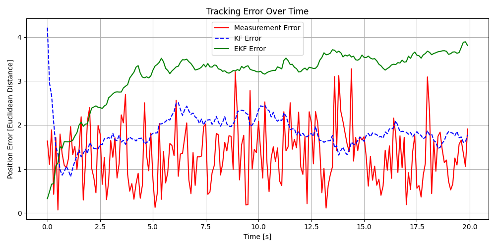
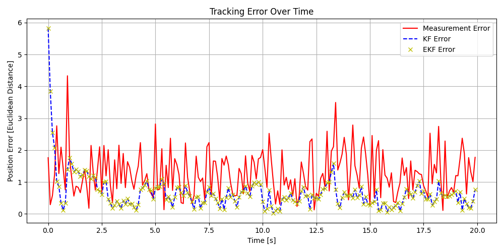

# Visual Tracking,  Kalman Filter(KF) vs Extended Kalman Filter (EKF)

Here's a Python example that simulates tracking a visual target (e.g., moving object in 2D) using both a Kalman Filter (KF) and an Extended Kalman Filter (EKF). 
The target moves in 2D with nonlinear motion (e.g., circular motion), which makes it suitable for showing the advantage of EKF over a linear KF.

## Assumptions:

- The object moves in a circle: x = R * cos(ωt), y = R * sin(ωt)
- Measurement noise is Gaussian
- EKF handles the nonlinear observation model

## Why might KF/EKF errors be worse than measurements?

1. KF model is mismatched (wrong motion or observation assumptions)
2. EKF update uses polar coordinates but measurements are Cartesian
3. Poorly tuned noise covariances (Q and R)

## Dig deeper why ?
1. KF model is mismatched (wrong motion or observation assumptions)
   - KF assumes a linear, static system (identity matrix F = I), but the true motion is circular and nonlinear.
   - So KF is not actually doing useful prediction → it's smoothing noisy inputs in a poor model.
     
2. EKF update uses polar coordinates but measurements are Cartesian
   - It convert noisy Cartesian (x, y) to polar (r, θ), which may amplify the noise (especially near the origin).
   - The EKF is estimating in Cartesian, but updating using noisy polar → the Jacobian and innovation mismatch can worsen the state estimate.
  
3. Poorly tuned noise covariances (Q and R)
   - If process noise Q is too small → filter trusts its (bad) model too much.
   - If measurement noise R is too large → filter doesn’t trust actual observations.
   - Either of these makes the estimate diverge or lag behind.

## How to improve it?
1. A 4D state KF and EKF (position + velocity)
   - x = [px, py, vx, vy] (4D state)
   - KF/EKF use velocity prediction rather than just smoothing.
2. Correct Jacobian for EKF (if using nonlinear motion)
3. Linear measurement model (no polar conversion)
4. Tuned Q and R
   - Q = diag([0.01, 0.01, 0.1, 0.1]) for CV model
   - R = diag([1.0, 1.0]) or estimate from measurement noise
   - Or estimate them from data: `R = np.cov((measurements - true_states).T)`

